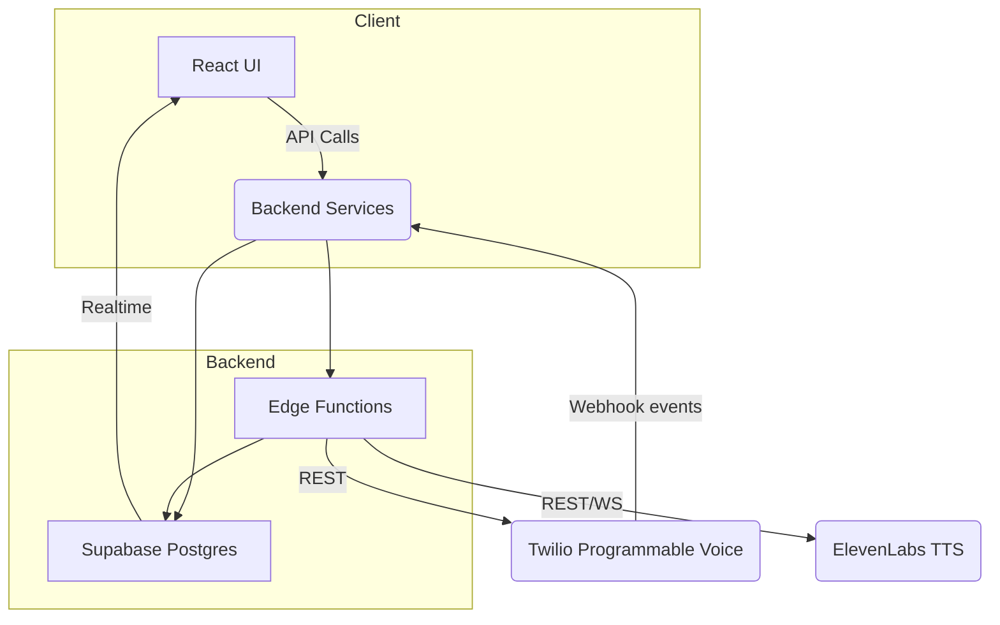

# Henk - AI Voice Agent for Charities

**Henk** is an AI voice agent that automates stewardship and fundraising calls for charities. By combining natural conversations, CRM integration, and compliance‑centric design, Henk reduces operational costs while improving donor engagement and conversion rates.

## 🚀 Core Benefits

- **24/7 Donor Outreach** – Always‑on voice agents that call when donors are available across time zones
- **Natural Conversations** – ElevenLabs neural TTS produces lifelike voices; knowledge base and tone settings adapt to each campaign
- **Actionable Insights** – Real‑time analytics surface optimal call times, donor sentiment, and conversion metrics
- **Plug‑and‑Play Integration** – Connects to existing CRMs in minutes; CSV import for rapid trials
- **GDPR‑first** – Row‑level security, consent tracking, and automated data erasure workflows
- **Lower Cost** – Minutes from Twilio plus a serverless stack cost a fraction of traditional call centers

## 🛠️ Technology Stack

| Layer                    | Primary Tech                                      | Notes                                                          |
| ------------------------ | ------------------------------------------------- | -------------------------------------------------------------- |
| **Frontend**             | **React 18 + TypeScript + Vite**                  | Modern React with TypeScript and fast build tooling            |
| **UI Components**        | **Shadcn UI + Tailwind CSS**                      | Beautiful, accessible components with utility-first CSS        |
| **Voice & Conversation** | **ElevenLabs Conversational AI**                  | Handles voice generation, transcription, and conversation flow |
| **Telephony**            | **Twilio Programmable Voice + TwiML**             | Outbound dial, DTMF capture, webhook events                    |
| **Database & Auth**      | **Supabase (Postgres + RLS + Realtime)**          | Managed database with real-time subscriptions                  |
| **Deployment**           | **Vercel**                                        | Serverless frontend + backend with preview deployments         |
| **Observability**        | Pino → Logtail, Vercel Analytics, Twilio Debugger | Slack alerts on spend & error thresholds                       |

## 🏗️ System Architecture



### How It Works

1. **UI (React)** fetches data via API calls and displays real-time updates
2. **Backend Services** authenticate with Supabase JWT then read/write to Postgres
3. **Edge Functions** act as workers (dial scheduler, CSV importer)
4. When a lead is due, the worker calls **Twilio** to start an outbound call
5. Twilio requests a **TwiML** document, which streams pre‑generated or live **ElevenLabs** audio
6. Call status events → Webhook → Edge function → `calls` table → Supabase Realtime channel → KPI widgets

## 🚀 Quick Start (Local Development)

> Goal: run the full stack locally in ≤10 minutes.

### Prerequisites

- Node.js 18.x or later (preferably the latest LTS version)
- PNPM (recommended) or npm
- Git

### Installation

#### 1. Clone & install

```bash
git clone <your-repo-url>
cd henk-main-page
pnpm install
```

#### 2. Environment variables

Copy the template and fill in keys (ask a maintainer for dev secrets):

```bash
cp .env.example .env.local
```

| Variable                  | Example                   | Notes                    |
| ------------------------- | ------------------------- | ------------------------ |
| `VITE_SUPABASE_URL`       | `https://xyz.supabase.co` | Dev project URL          |
| `VITE_SUPABASE_ANON_KEY`  | `ey...`                   | Supabase anon key        |
| `VITE_TWILIO_ACCOUNT_SID` | `ACxxxxxxxx`              | Twilio dev account       |
| `VITE_TWILIO_AUTH_TOKEN`  | `xxxxxxxx`                |                          |
| `VITE_TWILIO_CALLER_ID`   | `+15551234567`            | Verified outgoing number |
| `VITE_ELEVENLABS_API_KEY` | `e7xxxx`                  | Trial key                |

#### 3. Start the development server

```bash
pnpm dev
```

The application will be available at http://localhost:3000.

#### 4. Expose webhook endpoint (for production testing)

```bash
ngrok http 3000
```

Copy the HTTPS forwarding URL and set it in Twilio Console → Programmable Voice → Webhook (`/api/twilio/webhook`).

#### 5. Create a test call

In the dashboard, add yourself as a donor, start a campaign, then click **Start Campaign**. Wait for Twilio to call your phone with the demo script.

## 🧪 Development Commands

```bash
# Start development server
pnpm dev

# Build for production
pnpm build

# Preview production build
pnpm preview

# Lint code
pnpm lint

# Type checking
pnpm typecheck
```

## 📁 Project Structure

```
src/
├── components/           # React components
│   ├── ui/             # Shadcn UI components
│   ├── Header.tsx      # Site header
│   ├── HeroSection.tsx # Landing hero
│   ├── FeaturesSection.tsx # Product features
│   └── ...            # Other sections
├── pages/              # Page components
├── assets/             # Static assets
├── hooks/              # Custom React hooks
├── lib/                # Utility functions
└── main.tsx           # App entry point
```

## 🔧 Troubleshooting

- **401 Supabase**: verify `VITE_SUPABASE_ANON_KEY`
- **Twilio 11200**: ngrok URL unreachable; restart ngrok and update Twilio webhook
- **No audio**: check ElevenLabs quota or incorrect `voice_id`

## 🚀 Going to Production

### 1. Environment Setup

Set up production environment variables:

```bash
# Production environment
VITE_SUPABASE_URL=https://your-project.supabase.co
VITE_SUPABASE_ANON_KEY=your-production-anon-key
VITE_TWILIO_ACCOUNT_SID=your-production-sid
VITE_TWILIO_AUTH_TOKEN=your-production-token
VITE_TWILIO_CALLER_ID=your-verified-number
VITE_ELEVENLABS_API_KEY=your-production-key
```

### 2. Deploy to Vercel

```bash
# Install Vercel CLI
npm i -g vercel

# Deploy
vercel --prod
```

### 3. Set up Twilio Webhooks

Configure your production webhook URL in Twilio Console:

- Webhook URL: `https://your-domain.vercel.app/api/twilio/webhook`
- HTTP Method: POST

## 🎯 Ideal Stakeholders

- **Charity leadership** - Strategic decision makers
- **Fundraising managers** - Operational users
- **Potential investors** - Financial backers
- **Early engineering hires** - Technical team members

## 📄 License

This project is licensed under the MIT License.

## 🤝 Support

For support, please open an issue in this repository or contact the development team.

---

**Henk** - Empowering charities with AI-powered voice fundraising technology.
